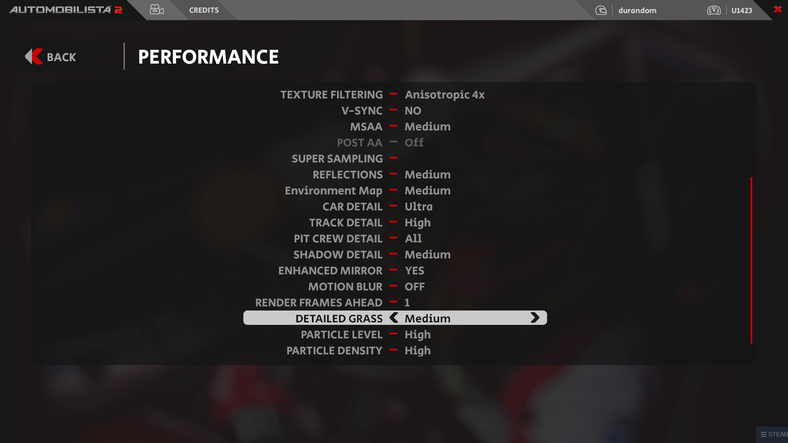
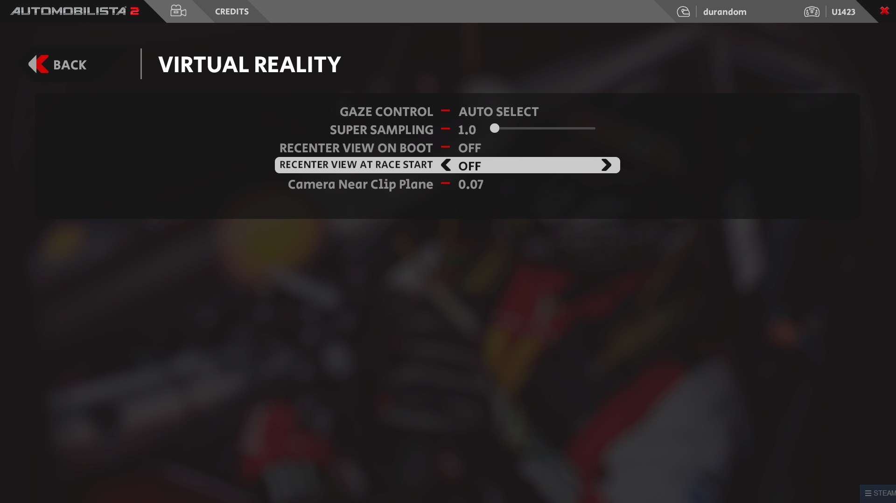
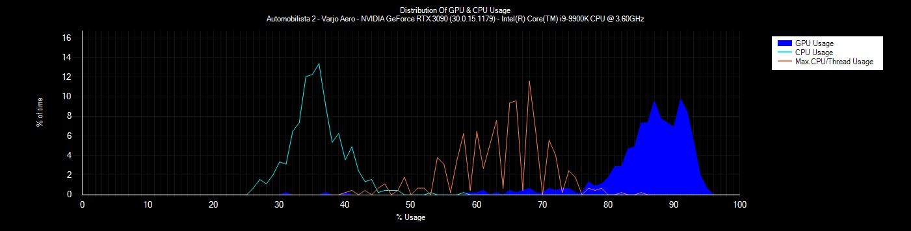

# Automobilista 2

### *!!! Make sure to check base configuration for your [headset](../README.md) !!!*


We're aiming at slightly below 90 fps in demanding situations - like being in the middle of the grid and driving past the pits. 

## Graphics settings

These are the settings in the UI.



## Benchmarking

I used an AI race at Nürburgring Grand Prix, 20 drivers, start middle of the grid, 3 laps, day time, Porsche GT3

fpsVR Report:
```
App: Automobilista 2 HMD: Varjo Aero (90.000 Hz, IPD 64.6)
GPU: NVIDIA GeForce RTX 3090 (30.0.15.1179, Tavg 66.2, Tmax 77) CPU: Intel(R) Core(TM) i9-9900K CPU @ 3.60GHz (Tavg 73.1, Tmax 86)
Delivered fps: 37.62  Duration: 17.3min. Headset was active: 100%
GPU Frametimes:
Median: 10.2 ms
99th percentile: 13.7 ms
99.9th percentile: 15.3 ms
frametime <11.1ms(vsync): 85.6%
CPU frametime:
Median: 7.9 ms
99th percentile: 12 ms
99.9th percentile: 14.5 ms
frametime <11.1ms(vsync): 97.5%
Reprojection Ratio: 0.0% (for Index/Vive/VivePro headsets only)
Dropped frames: 1 or 0.0% (for Index/Vive/VivePro headsets only)
Max. SteamVR SS: 100%
Render resolution per eye: 3140x2692(by SteamVR settings, Max.) (HMD driver recommended: 3140x2692)
```




