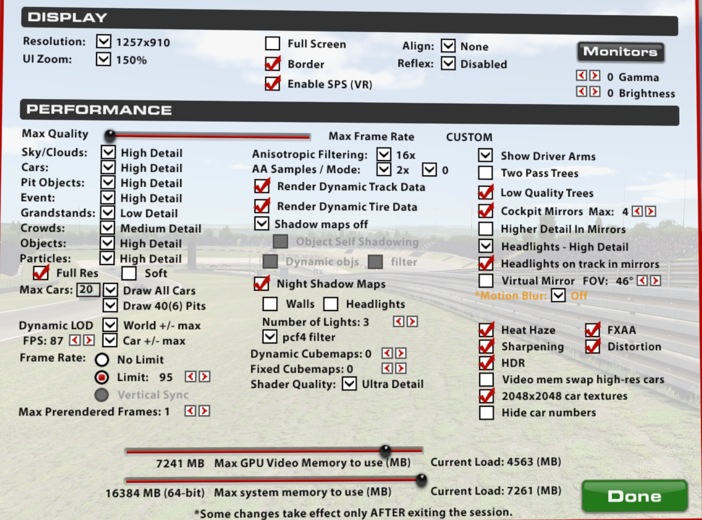
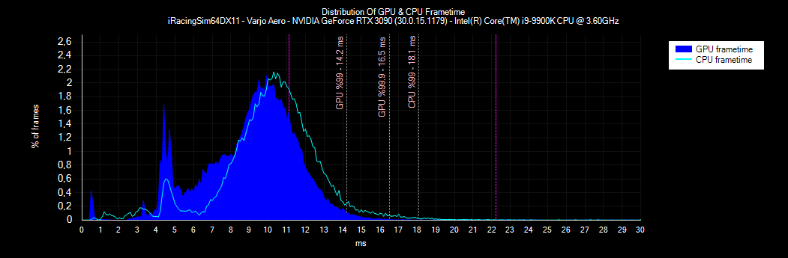
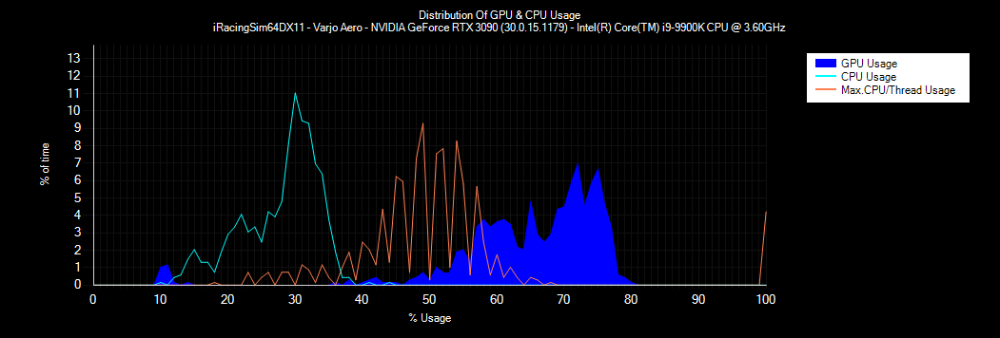

# iRacing

### *!!! Make sure to check base configuration for your [headset](../README.md) !!!*


We're aiming at slightly below 90 fps in demanding situations - like being in the middle of the grid and driving past the pits. 

## Graphics settings

All settings are done in `rendererDX11.ini` or via the UI.

The following setting fix the warping problem.

```
[OpenVR]
FixGetProjectionRawBug=1                        	; Might help fix vertical eye alignment issues
```

These are the settings in the UI.


## Benchmarking

I used an AI race at Nürburgring Grand Prix, 40 drivers, start middle of the grid, 3 laps, day time, Porsche GT3

fpsVR Report:
```App: iRacingSim64DX11 HMD: Varjo Aero (90.000 Hz, IPD 64.6)
GPU: NVIDIA GeForce RTX 3090 (30.0.15.1179, Tavg 70.5, Tmax 75) CPU: Intel(R) Core(TM) i9-9900K CPU @ 3.60GHz (Tavg 71.2, Tmax 88)
Delivered fps: 79  Duration: 11.7min. Headset was active: 100%
GPU Frametimes:
Median: 9.4 ms
99th percentile: 14.2 ms
99.9th percentile: 16.5 ms
frametime <11.1ms(vsync): 81.5%
CPU frametime:
Median: 10.3 ms
99th percentile: 18.1 ms
99.9th percentile: >30 ms
frametime <11.1ms(vsync): 66.4%
Reprojection Ratio: 0.0% (for Index/Vive/VivePro headsets only)
Dropped frames: 1 or 0.0% (for Index/Vive/VivePro headsets only)
Max. SteamVR SS: 100%
Render resolution per eye: 3140x2692(by SteamVR settings, Max.) (HMD driver recommended: 3140x2692)
```




## Additional tweakings

See the [SCRATCH.md](SCRATCH.md) for more potentially usefull settings and tweaks.

## Resources

* https://www.reddit.com/r/iRacing/comments/f0ac4p/another_vr_settings_post/
* https://www.reddit.com/r/iRacing/comments/dn366z/most_pc_intensive_road_track/
* GaryT's [rendererDX11.ini](rendererDX11-GaryT.ini)
* autoconfigure's [rendererDX11.ini](rendererDX11-auto-configure-3090.ini)